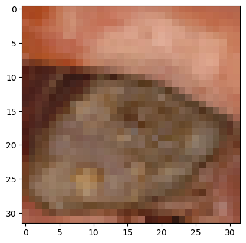
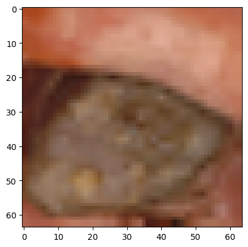

## B-spline-interpolation

- In this code, you can see using cubic b-spline interpolation in graph
- We draw a cubic B-spline which degree k=3 as it's the most used one. We need now to define the knots vector, with k
  ending equal knots:

```
l=len(x)
t=np.linspace(0,1,l-2,endpoint=True)
t=np.append([0,0,0],t)
t=np.append(t,[1,1,1])
 ```

Drawing it using matplotlib :


With this code:

```
plt.plot(x,y,'k--',label='Control polygon',marker='o',markerfacecolor='red')
plt.plot(out[0],out[1],'b',linewidth=2.0,label='B-spline curve')
plt.legend(loc='best')
plt.axis([min(x)-1, max(x)+1, min(y)-1, max(y)+1])
plt.title('Cubic B-spline curve evaluation')
plt.show()
```

Original image:



And there is some values of the image array's

```
[[ 35  34  29  38  62  84 101 107]
 [ 98  91  93  86  91  95  99 101]
 [106 111 108 106 102  99  86  78]
 [ 75  74  72  76  78  77  78  78]]
```

Resized image:



And there is some values of the new image array's
```
[[ 35  34  34  31  29  33  38  50]
 [ 62  73  84  92 101 104 107 102]
 [ 98  94  91  92  93  89  86  88]
 [ 91  93  95  97  99 100 101 103]
 [106 108 111 109 108 107 106 104]
 [102 100  99  92  86  82  78  76]
 [ 75  74  74  73  72  74  76  77]
 [ 78  77  77  77  78  78  78  78]]
```