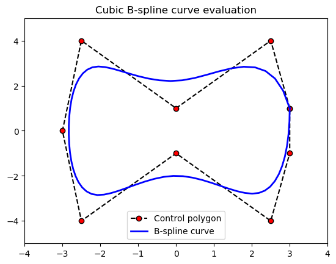

## B-spline-interpolation
- In this code, you can see using cubic b-spline interpolation in graph
- We draw a cubic B-spline which degree k=3 as it's the most used one. We need now to define the knots vector, with k ending equal knots:
```
l=len(x)
t=np.linspace(0,1,l-2,endpoint=True)
t=np.append([0,0,0],t)
t=np.append(t,[1,1,1])
 ```
Drawing it using matplotlib :

With this code:
```
plt.plot(x,y,'k--',label='Control polygon',marker='o',markerfacecolor='red')
plt.plot(out[0],out[1],'b',linewidth=2.0,label='B-spline curve')
plt.legend(loc='best')
plt.axis([min(x)-1, max(x)+1, min(y)-1, max(y)+1])
plt.title('Cubic B-spline curve evaluation')
plt.show()
```